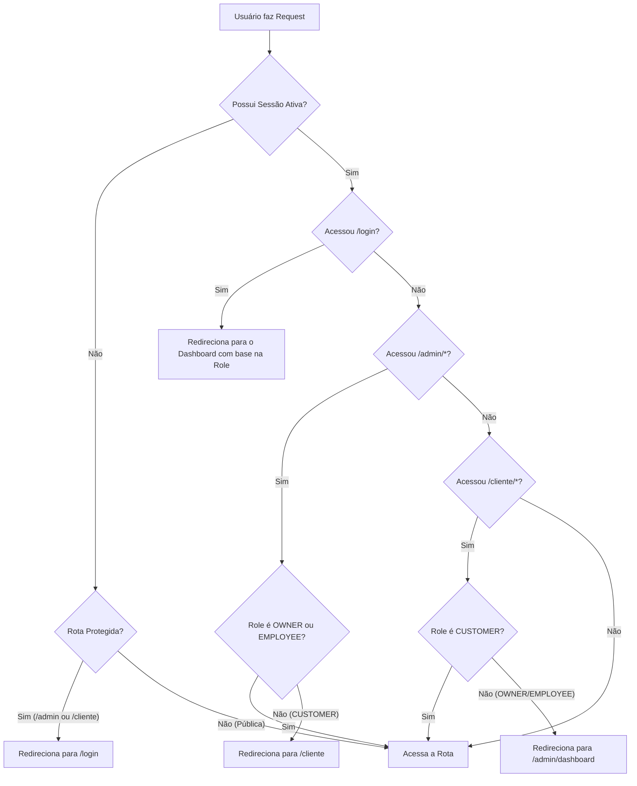

# Fluxo de Autenticação e Sessão - TECNOMOTOS

A plataforma TECNOMOTOS utiliza o **Supabase Auth** como provedor de identidade, integrado de forma segura às regras de renderização e rotas do Next.js (App Router).

---

## 🔐 Sessão baseada em Cookies

Para permitir que o servidor Next.js conheça o estado de autenticação antes de renderizar a página (evitando telas brancas ou flashes de conteúdo), o fluxo utiliza cookies de sessão:

1. **signInWithPassword**: O formulário do cliente na página `/login` envia as credenciais diretamente ao Supabase usando o cliente de navegador (`@supabase/ssr`).
2. **Cookies de Sessão**: O Supabase grava os tokens de acesso (`access_token` e `refresh_token`) nos cookies do navegador.
3. **Middleware**: Em cada requisição HTTP de navegação, o arquivo `src/middleware.ts` intercepta o request, lê os cookies e refresca os tokens automaticamente no Supabase para manter o usuário logado com segurança.

---

## 🚦 Middleware de Proteção de Rotas

O middleware classifica as rotas do sistema para redirecionar usuários não autorizados:

---

## 🚪 Fluxo de Logout

O encerramento de sessão é disparado no botão de logout da `Topbar` do painel administrativo e na `Navbar` do cliente:
1. Chama `supabase.auth.signOut()` no cliente.
2. Limpa os cookies de sessão correspondentes.
3. Exibe um Toast de sucesso e redireciona o usuário para a página de `/login`.
