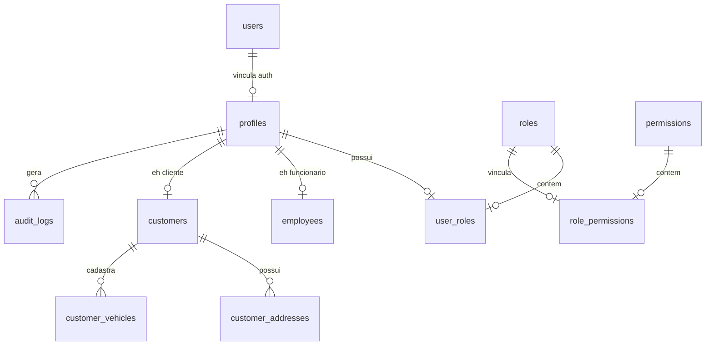

# Modelagem do Banco de Dados - TECNOMOTOS

O banco de dados da TECNOMOTOS é hospedado no Supabase PostgreSQL. Toda a estrutura de dados é gerenciada e versionada através de migrações SQL na pasta `supabase/migrations/`.

---

## 🗺️ Diagrama de Relacionamentos (ER)

---

## 📋 Detalhes das Tabelas

### 1. Perfis e Cadastros Básicos
- **`profiles`**: Estende a tabela `auth.users` do Supabase para o escopo público.
  - `status` (`ACTIVE`, `INACTIVE`, `BLOCKED`): Define se o usuário tem acesso ativo ao sistema.
- **`employees`**: Armazena salários, documentos fiscais (CPF/CNPJ) e data de contratação do funcionário. Possui relacionamento de chave primária direta com `profiles(id)`.
- **`customers`**: Armazena informações cadastrais dos clientes.
- **`customer_addresses`**: Lista de endereços de entrega e faturamento de clientes. Suporta flag `is_default` para checkout rápido.
- **`customer_vehicles`**: Cadastro das motocicletas dos clientes, contendo dados como marca, modelo, ano, placa, chassi (VIN) e quilometragem, essenciais para diagnósticos da oficina.

### 2. Controle de Acesso (RBAC)
- **`roles`**: Contém as funções do sistema: `OWNER` (proprietário), `EMPLOYEE` (funcionário) e `CUSTOMER` (cliente).
- **`permissions`**: Lista completa de chaves de permissão granulares (ex: `products.create`, `inventory.update`, `financial.view`).
- **`role_permissions`**: Tabela associativa relacionando quais permissões pertencem a cada função.
- **`user_roles`**: Tabela de associação definindo quais funções o usuário possui.

### 3. Logs de Sistema e Auditoria
- **`audit_logs`**: Tabela de histórico crítico de alterações no sistema. Registra o usuário que realizou a ação, a entidade modificada, o IP do cliente e os payloads de antes (`old_data`) e depois (`new_data`) em formato JSONB.
- **`settings`**: Parâmetros de configuração mutáveis armazenados em formato JSONB no banco para acesso dinâmico do servidor.

---

## ⚡ Triggers e Automações

1. **`on_auth_user_created`**: Disparada automaticamente após a inserção de um usuário na tabela interna do Supabase `auth.users`. Ela cria o perfil correspondente na tabela `public.profiles` com dados iniciais, cria a entrada básica em `public.customers` e insere a role `CUSTOMER` por padrão em `public.user_roles`.
2. **`trigger_sync_user_role`**: Disparada após qualquer alteração (`INSERT`, `UPDATE`, `DELETE`) na tabela `public.user_roles`. Ela atualiza dinamicamente a propriedade `raw_app_meta_data->'role'` na tabela interna `auth.users`, embutindo a role do usuário no seu JWT de autenticação para otimizar validações do Middleware.
3. **`update_*_modtime`**: Atualiza a coluna `updated_at` com o timestamp corrente (`now()`) em todas as alterações de linhas das tabelas principais.
