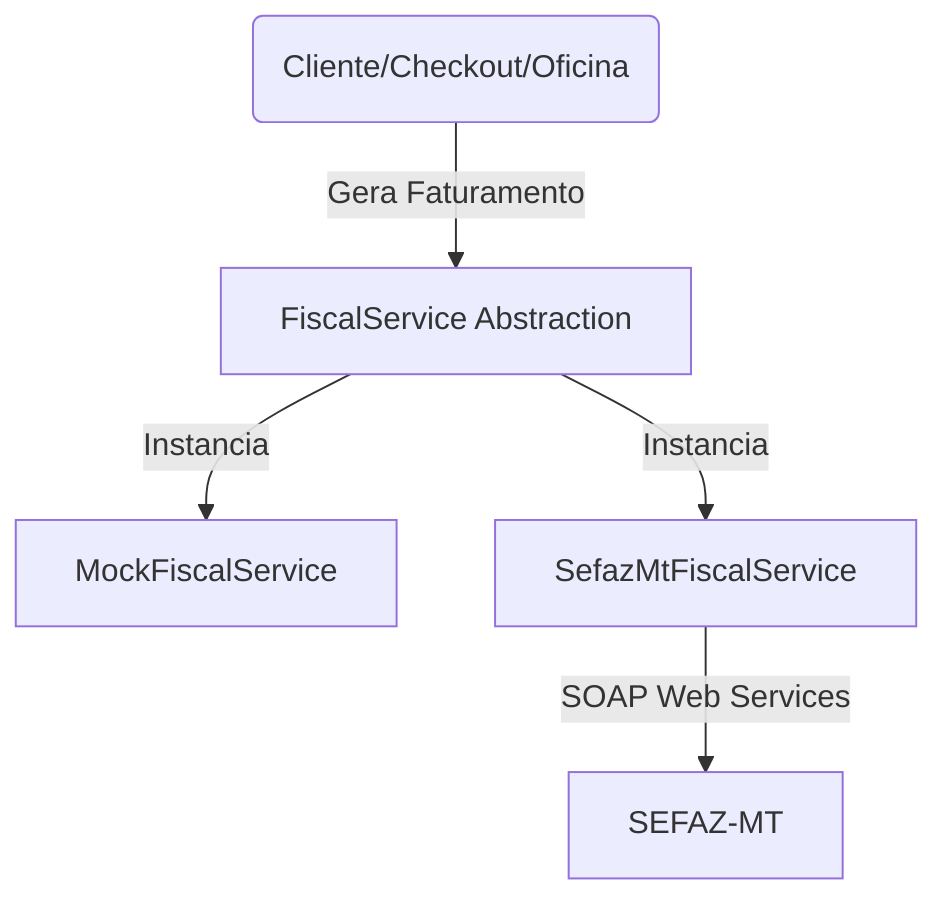

# Arquitetura do Módulo Fiscal - TECNOMOTOS

Este documento descreve o projeto de arquitetura de software para a emissão e monitoramento de documentos fiscais eletrônicos da TECNOMOTOS.

## 1. Visão Geral

O módulo fiscal adota uma camada de abstração sólida, garantindo que o restante do sistema (ex: checkout da loja, módulo de ordens de serviço da oficina) nunca dependa de particularidades de protocolos de comunicação legados, XML ou SOAP.

## 2. Camada de Abstração (`FiscalService`)

A classe abstrata `FiscalService` define os contratos TypeScript estritos para todas as operações fiscais:
* `createNfce()`: Montagem de rascunhos em formato XML.
* `signNfce()`: Assinatura digital no padrão XMLDSig.
* `sendNfce()`: Transmissão por SOAP 1.2 com TLS e certificado do cliente.
* `queryNfce()`: Consulta por chave de acesso de 44 dígitos.
* `cancelNfce()`: Cancelamento por evento do emitente.
* `invalidateNfceNumber()`: Inutilização de lacunas numéricas.
* `getServiceStatus()`: Checagem de disponibilidade da SEFAZ-MT.

## 3. Segurança e Segredos Fiscais

1. **Sem Segredos no Client-Side**: O certificado digital A1 (.pfx) e as chaves privadas nunca são carregados ou expostos no navegador. Eles residem exclusivamente em variáveis de ambiente da Vercel (`FISCAL_CERTIFICATE_BASE64` e `FISCAL_CERTIFICATE_PASSWORD`).
2. **Políticas RLS (Row Level Security)**:
   * A tabela `fiscal_settings` só permite escrita ao usuário com função `OWNER`.
   * A visualização de documentos em `fiscal_documents` é restrita aos respectivos clientes (somente suas notas) e a operadores autorizados com permissão `fiscal.view`.
